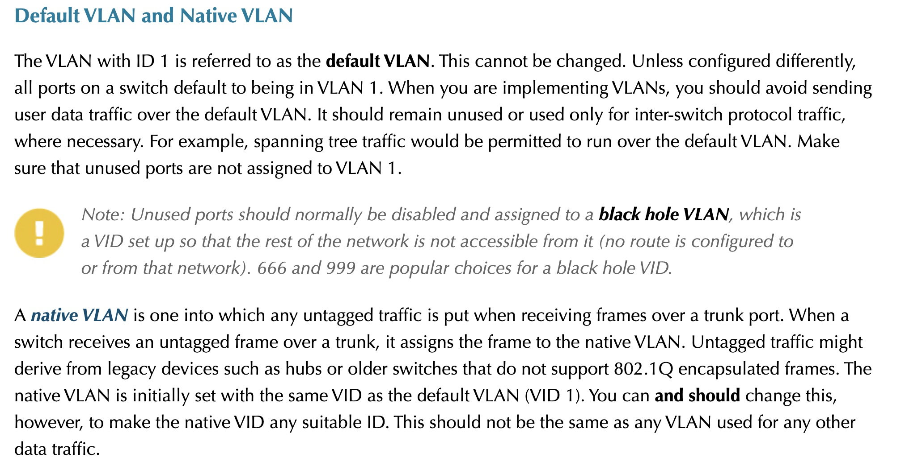
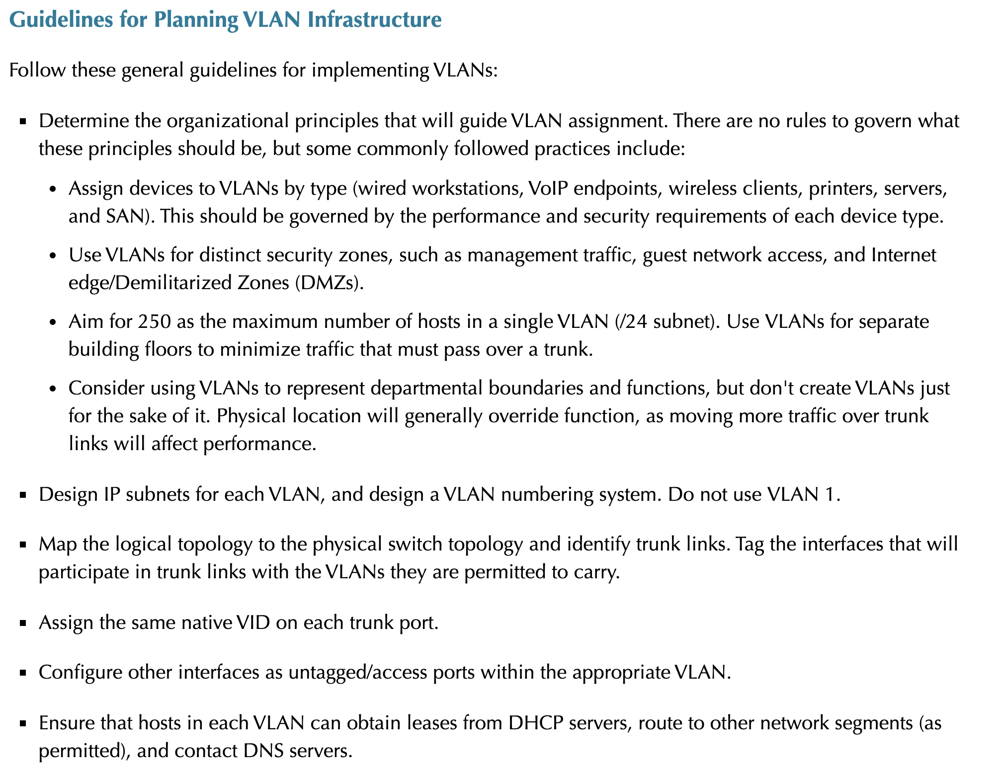

## Resources

---

- TODO [Observium SNMP](https://observium.org/)
- TODO [Wireshark](https://www.wireshark.org/)
- TODO Nextclound
- TODO `iperf`
- TODO [nmap](https://nmap.org/download.html)
- TODO `dig`
- TODO [grafana and loki for logging](https://youtu.be/h_GGd7HfKQ8)
- TODO [Lansweeper IT Asset Management Software?](https://www.lansweeper.com/)
- TODO portainer
- TODO [heimdall](https://github.com/linuxserver/Heimdall) (the dashboard for all your services)
- TODO [guacamole](https://guacamole.apache.org/) for SSH'ing into your services easier [example](https://youtu.be/E3aVxNtxFsU)
- TODO [truenas](https://www.truenas.com/)
- TODO use [[s.apps.gns3]] to map my home network (learn more about [[s.apps.gns3]])
  - TODO [Visualize Your Network with GNS3](https://www.gns3.com/)
- Self hosted bitwarden
- TODO mac and port security:
  - 
- TODO guest network for people visiting the house to keep them off the main network
  - 

---

- Patch Panel
  - [[r.+.2021.11.15.what-is-a-patch-panel-do-you-need-one]]
- Server
  - [ ] [Projects to Build](https://youtu.be/SVQmzaSabEQ)
    - fire wall (pfsense)
    - VPN
    - backup server (also push to remote cloud like one drive)
    - database server (postgres)
    - docker containers (docker)
    - virtual machines
    - Pi-Hole
    - FTP server (filezilla?)
    - web server (host a website)
    - IOT (<https://www.home-assistant.io/>)
    - running `iperf` on the server as a background process to run internal network speedtests instead of outside services
    - nextcloud (calendar services?)
    - photo prism
    - home assistant
    - ansible IAC infrastructure as code
    - [grafana loki for logging](https://youtu.be/h_GGd7HfKQ8)
    - heimdall service?
    - VLAN's for various utility purposes
      - `"...it is common practice to isolate server-to-server traffic from client-server traffic and to isolate administration/management traffic (channels used for inbound management of appliances and servers). Another standard configuration option is to create a "null" VLAN that is non-routable to the rest of the network. This VLAN is used for any physical ports that do not have authorized connected equipment."`
      - 
      - 
- Useful Resources
  - [Wolfgangs channel - what he's running on his home server](https://youtu.be/f5jNJDaztqk)
  - [affordable gear?](https://www.pcliquidations.com/p48428-amd-radeon-r5-340x?r=160164167166161&utm_source=bing&utm_medium=cpc&utm_campaign=CPCS_PCLiq-Shopping&utm_term=4581046488142443&utm_content=Products#)
