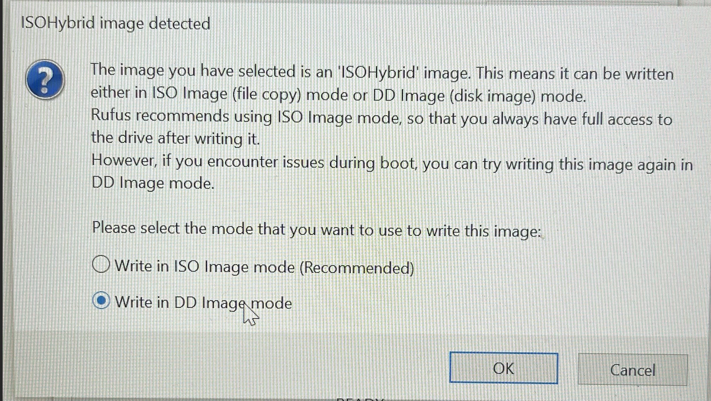

## 2021

- Download Arch ISO from [Archlinux.org](https://archlinux.org/download/)
- On a Windows machine download [Rufus](https://rufus.ie/en/)
  - Use Rufus to burn the ISO to a USB
  - This makes a bootable disk for bootstrapping the system
  - Settings as of 2021-10-25
    - 
    - 
- insert USB into machine
- [Helpful installation guide](https://wiki.archlinux.org/title/Installation_guide)
- in the computer setup menu change the boot order to boot from the USB as first priority
- Ensure UEFI mode is active and prefered, verify once on the CLI with: `ls /sys/firmware/efi/efivars`
- Connect over wifi using `iwctl` 
  - Interactive Mode (These menus have Tab completion)
    - First, if you do not know your wireless device name, list all Wi-Fi devices: `[iwd]# device list`
    - Then, to scan for networks: `[iwd]# station <device> scan`
    - You can then list all available networks: `[iwd]# station <device> get-networks`
    - Finally, to connect to a network: `[iwd]# station <device> connect <SSID>`
  - Single Command with passed values: `iwctl --passphrase <passphrase> station <device> connect <SSID>`
- **AT THIS STAGE YOU CAN JUST RUN THE ARCHINSTALL SCRIPT AND CALL IT DONE AFTERWARDS**
  - no need to stay in chroot afterwards
  - restart computer and log back in using user account
- installed `netctl` and `dialog` to use `wifi-menu`
  - also got connected to internet via `nmcli device wifi connect SSID_or_BSSID password password` nmcli comes from the NetworkManager program
- **AT THIS POINT IT WOULD BE IDEAL TO LAUNCH A BOOT STRAPPING SCRIPT FOR ALL THE USER SETTINGS AND PACKAGES FOR THE DESKTOP ENVIRONMENT**
  - such as [LARBS](https://github.com/tallguyjenks/LARBS/blob/master/larbs.sh) but repurposed for my own usage
