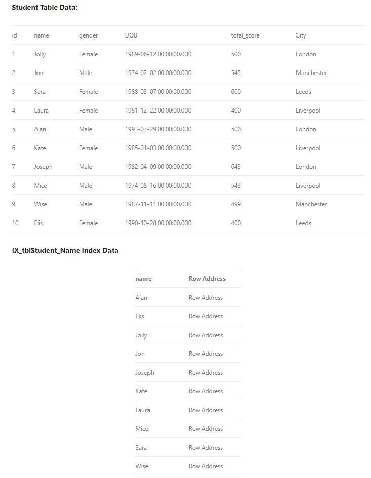

> A non-clustered index doesn’t sort the physical data inside the table. In fact, a non-clustered index is stored at one place and table data is stored in another place. This is similar to a textbook where the book content is located in one place and the index is located in another. This allows for more than one non-clustered index per table.
> <br>
> It is important to mention here that inside the table the data will be sorted by a clustered index. However, inside the non-clustered index data is stored in the specified order. The index contains column values on which the index is created and the address of the record that the column value belongs to.
> <br>
> When a query is issued against a column on which the index is created, the database will first go to the index and look for the address of the corresponding row in the table. It will then go to that row address and fetch other column values. **It is due to this additional step that non-clustered indexes are slower than [[TSQL Clustered Index|s.q.tsql.indexes.clustered-index]].**

```sql
CREATE DATABASE schooldb
          
CREATE TABLE student (
    id INT PRIMARY KEY, -- <==
    name VARCHAR(50) NOT NULL,
    gender VARCHAR(50) NOT NULL,
    DOB datetime NOT NULL,
    total_score INT NOT NULL,
    city VARCHAR(50) NOT NULL
)

--------------------------------
USE schooldb
          
EXECUTE sp_helpindex student
```

The above query will return this result:


```sql
USE schooldb
          
INSERT INTO student
 
VALUES  
(6, 'Kate', 'Female', '03-JAN-1985', 500, 'Liverpool'), 
(2, 'Jon', 'Male', '02-FEB-1974', 545, 'Manchester'),
(9, 'Wise', 'Male', '11-NOV-1987', 499, 'Manchester'), 
(3, 'Sara', 'Female', '07-MAR-1988', 600, 'Leeds'), 
(1, 'Jolly', 'Female', '12-JUN-1989', 500, 'London'),
(4, 'Laura', 'Female', '22-DEC-1981', 400, 'Liverpool'),
(7, 'Joseph', 'Male', '09-APR-1982', 643, 'London'),  
(5, 'Alan', 'Male', '29-JUL-1993', 500, 'London'), 
(8, 'Mice', 'Male', '16-AUG-1974', 543, 'Liverpool'),
(10, 'Elis', 'Female', '28-OCT-1990', 400, 'Leeds');
-- NOTE id's in random order upon insertion

--------------------------------
USE schooldb
          
SELECT * FROM student
```


```sql
use schooldb
 
CREATE NONCLUSTERED INDEX IX_tblStudent_Name
ON student(name ASC)
```

> The above script creates a non-clustered index on the “name” column of the student table. The index sorts by name in ascending order. As we said earlier, the table data and index will be stored in different places. The table records will be sorted by a clustered index if there is one. The index will be sorted according to its definition and will be stored separately from the table.


